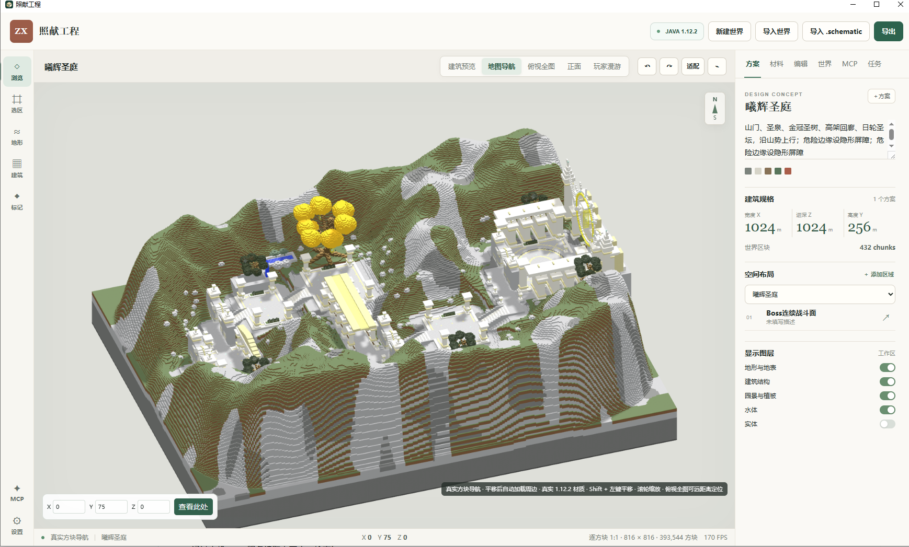
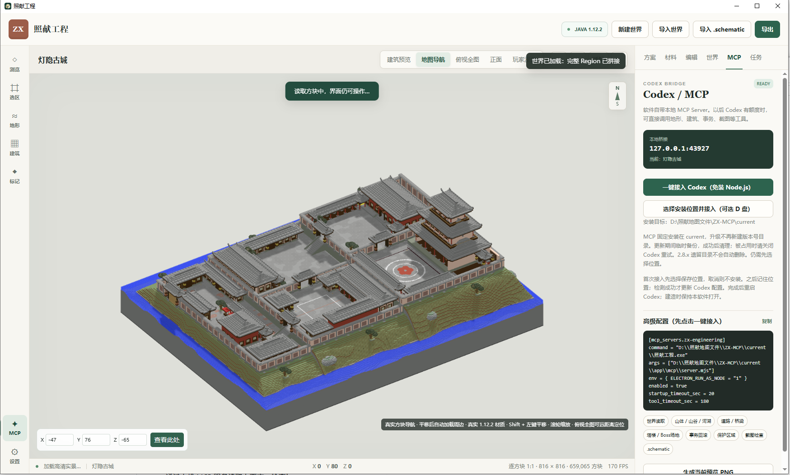

# 照献工程｜Minecraft 1.12.2 地图生成与世界编辑器

[English](README_EN.md) · [直接下载 Windows 免安装版](https://github.com/ZhaoXianYa/zhaoxian-minecraft-map-studio/releases/latest)

照献工程是一款面向 **Minecraft Java 1.12.2** 的桌面地图制作工具。它把世界存档、建筑预览、地形编辑、结构导入导出和 Codex 辅助工作流放在同一个可视化界面里，适合制作 RPG 地图、副本、主城和大型建筑群。

软件在本地读取和修改地图，不会上传世界存档。普通使用者下载一个 EXE 就能运行，不需要安装程序，也不需要配置 Node.js。

> 这是一个由实际 Minecraft 地图制作需求推动的个人开源项目。如果你遇到方块显示、旧版存档兼容或大型地图性能问题，欢迎带着复现步骤提交 Issue。

## 成品效果

### 大型地形与建筑群预览



### 中式城池与 Codex / MCP 工作流



## 下载：一个 EXE，免安装运行

前往 [Releases 下载最新版](https://github.com/ZhaoXianYa/zhaoxian-minecraft-map-studio/releases/latest)，双击 `Zhaoxian-Engineering-2.11.0-Windows-x64.exe` 即可运行。

- 支持 Windows 10 / 11 x64
- 便携版，无安装向导，不写入系统安装目录
- 普通地图浏览、编辑和导出不需要 Node.js
- 内置本地 MCP Server；在软件中点击 **“一键接入 Codex（免装 Node.js）”** 即可接入
- 当前程序未购买商业代码签名，Windows 首次运行时可能提示“未知发布者”

正式编辑地图前，请保留一份世界存档备份。

## 能做什么

### 世界读取与大地图浏览

- 直接打开包含 `region` 目录的 Minecraft Java 1.12.2 世界
- 读取 Anvil `.mca` 区域文件，显示地形、建筑、植被、水体和实体图层
- 提供建筑预览、地图导航、俯视全图、正面视图和第一人称漫游
- 支持坐标定位、视角适配、预览范围调整和完整 Region 拼接
- 可使用原版 1.12.2 JAR 或资源包 ZIP 显示游戏材质

### 地图规划与生成

- 在方案面板记录地图主题、设计概念、色板和建筑规格
- 按区域组织 Boss 战场、道路、建筑群、景观和功能区
- 生成或修改山体、山谷、河湖、道路、桥梁、屏障和建筑结构
- 用选区控制修改范围，减少误改其他区域的风险
- 支持显示网格、边界、屏障和不同地图图层，方便检查空间关系

### 方块编辑与安全保存

- 对指定坐标或选区执行方块读取、替换和批量编辑
- 写入世界前执行地图检查，并为修改建立事务备份
- 支持撤销已执行的事务，降低直接修改存档的风险
- 保留传统 1.12.2 Block ID / Data 工作流
- 大范围预览和实际存档写入分开处理，浏览时不会自动改动地图

### 结构导入、导出与复用

- 导入现有 Minecraft 世界
- 导入传统 `.schematic` 建筑文件并在地图中预览
- 导出 MCEdit / Minecraft 1.12.2 可用的 `.schematic`
- 将完成的区域或建筑交给 WorldEdit、MCEdit 等旧版工具继续使用

### Codex / MCP 辅助制图

- 软件内置本地 MCP Server，不需要另外安装 Node.js
- 点击 **“一键接入 Codex（免装 Node.js）”** 自动写入当前 Codex 配置
- 也可选择其他磁盘作为固定接入位置，方便便携使用和版本升级
- Codex 可读取当前世界、地图方案、坐标与选区上下文
- 可调用世界读取、山体/山谷/河湖、道路/桥梁、Boss 场地、保护区域、事务回滚和截图检查等工具
- MCP 只监听 `127.0.0.1`，并使用每次启动随机生成的令牌

## 第一次使用

1. 从 [Releases](https://github.com/ZhaoXianYa/zhaoxian-minecraft-map-studio/releases/latest) 下载便携版 EXE。
2. 双击运行，选择 **新建世界**、**导入世界**或**导入 .schematic**。
3. 导入世界时选择包含 `region` 文件夹的存档目录。
4. 需要 Codex 时，打开右侧 **MCP** 面板并点击 **一键接入 Codex（免装 Node.js）**。
5. 修改真实存档前先备份，并在匹配的 Minecraft 1.12.2 客户端或服务器中复查结果。

## 开发与构建

只有参与源码开发时才需要 Windows x64 和 Node.js 22：

```powershell
npm ci
npm test
npm start
```

```powershell
npm run doctor    # 检查开发环境
npm run dev       # 开发模式
npm run pack:win  # 生成 Windows 便携版
```

手动 MCP 配置和故障排查见 [MCP接入说明.md](MCP接入说明.md)。

## 项目结构

- `electron/`：桌面程序主进程、预加载桥接和本地代理
- `src/core/`：世界读取、编辑、事务、资源包和预览逻辑
- `src/renderer/`：Three.js 界面与渲染器
- `mcp/`：本地 MCP 服务入口
- `tools/`：诊断、打包与核心自检脚本

## 当前限制

- 主要面向 Minecraft Java 1.12.2 的传统 ID / Data 世界格式。
- 部分特殊方块使用简化几何，例如连接栅栏、门状态和植物。
- 大范围预览的内存占用会随范围增加；普通建筑建议先使用 2–4 区块半径。
- 第一人称漫游允许穿墙，仅用于预览，不代表游戏客户端中的碰撞效果。
- 离线自检不能替代真实 Minecraft 客户端或服务器验收。

## 贡献与反馈

欢迎提交 Issue、可复现的测试地图和 Pull Request，细则见 [CONTRIBUTING.md](CONTRIBUTING.md)。报告问题时请说明 Minecraft 版本、世界格式、操作步骤，以及问题是否能在原版客户端复现。请勿上传私人服务器数据或无权再分发的地图。

## 许可证

代码采用 [MIT License](LICENSE)。Minecraft、Mojang、Microsoft 及其他第三方名称和资源属于其各自权利人；本项目与其没有隶属或官方认可关系。
